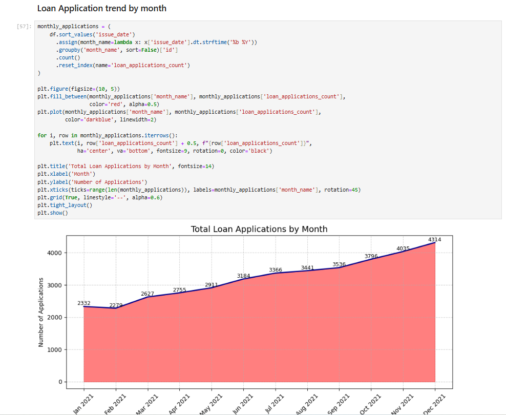

# Bank-Loan-Analysis-with-python

Bank loan Analysis

In this project, I've analysed the data to find insight like:

total_funded_amount 

total_received_amount

loan application growth

profitable loans 

Loss making loans

And many more metrics and created charts and plot this data.

